# 🏠 HomeLab — Infrastructure Windows Server & Active Directory

> **Projet personnel de lab IT** construit sur matériel de récupération.  
> Objectif : reproduire un environnement d'entreprise complet (AD DS, DNS, DHCP, WDS/PXE, GPO, supervision) pour pratiquer l'administration système.

---

## 📋 Sommaire

1. [Infrastructure matérielle](#1-infrastructure-matérielle)
2. [Hyperviseur ESXi 7.0 — NUC i5](#2-hyperviseur-esxi-70--nuc-i5)
3. [Windows Server 2019 — DC_SRV](#3-windows-server-2019--dc_srv)
4. [Déploiement PXE via WDS](#4-déploiement-pxe-via-wds)
5. [Jonction au domaine — Vostro PC-USER](#5-jonction-au-domaine--vostro-pc-user)
6. [Stratégies de groupe (GPO)](#6-stratégies-de-groupe-gpo)
7. [Serveur de fichiers — SRV_FILES](#7-serveur-de-fichiers--srv_files)
8. [Supervision avec Nagios 4](#8-supervision-avec-nagios-4)
9. [Commutateur Cisco Catalyst 2960](#9-commutateur-cisco-catalyst-2960)
10. [Bilan et compétences acquises](#10-bilan-et-compétences-acquises)

---

## 1. Infrastructure matérielle

| Rôle | Matériel | OS / Logiciel |
|------|----------|---------------|
| Hyperviseur | Intel NUC i5 | VMware ESXi 7.0.3 |
| Contrôleur de domaine (DC_SRV) | VM sur ESXi | Windows Server 2019 |
| Serveur de fichiers (SRV_FILES) | VM sur ESXi | Windows Server 2019 |
| Supervision (Nagios) | VM sur ESXi | Debian/Ubuntu |
| Poste client (PC-USER) | Dell Vostro (i3 / 6 Go RAM) | Windows 10 Pro |
| Switch | Cisco Catalyst 2960 | IOS |
| Passerelle WAN | Routeur 4G+ Soyealink B535 | — |

### Schéma réseau simplifié

```
Internet
    │
[Routeur 4G+] ── passerelle XXX.XXX.1.1
    │
[Cisco Catalyst 2960]
    │
    ├── NUC ESXi
    │       ├── DC_SRV    (XXX.XXX.1.110)  ← AD DS / DNS / DHCP / WDS
    │       ├── SRV_FILES (XXX.XXX.1.121)  ← Serveur de fichiers
    │       └── Nagios VM (XXX.XXX.1.123)  ← Supervision
    │
    └── Dell Vostro PC-USER (XXX.XXX.1.120 via DHCP)
```

> 🔒 Les deux premiers octets des adresses IP sont masqués pour des raisons de confidentialité.

---

## 2. Hyperviseur ESXi 7.0 — NUC i5

### 2.1 Préparation du BIOS

Avant toute installation, le BIOS du NUC a été configuré :

| Paramètre | Valeur | Raison |
|-----------|--------|--------|
| Mode de boot | **UEFI** | Compatibilité ESXi 7.0 |
| Secure Boot | **Désactivé** | Nécessaire pour le boot MediCat |
| Intel VT-x | **Activé** | Virtualisation CPU obligatoire pour ESXi |
| Intel VT-d | **Activé** | Virtualisation des I/O (USB Passthrough, etc.) |

> ⚠️ **ESXi 8 n'a pas fonctionné** sur ce NUC — retour sur la version **7.0.3** qui s'est installée sans problème.

### 2.2 Installation d'ESXi 7.0.3

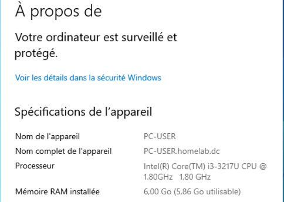

Une fois installé, ESXi récupère une IP via le DHCP du routeur, puis l'IP est fixée manuellement.

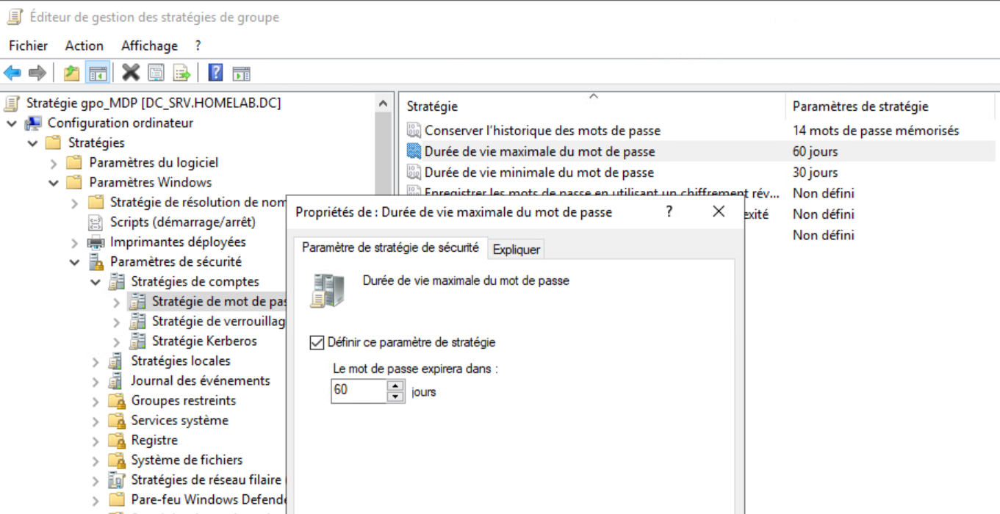

---

## 3. Windows Server 2019 — DC_SRV

### 3.1 Configuration réseau statique

La première étape après l'installation de Windows Server est de fixer l'adresse IP. Un contrôleur de domaine **ne doit jamais utiliser le DHCP** — son IP doit être stable et prévisible.

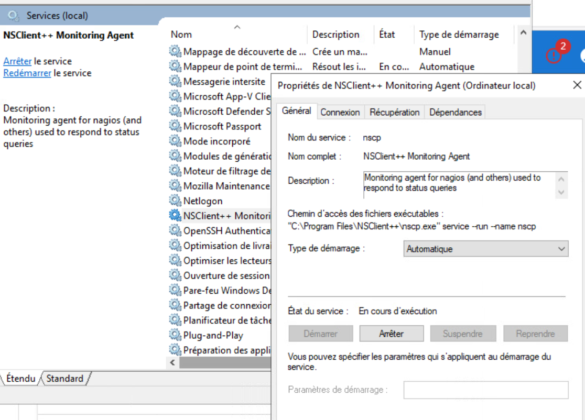  
*Avant : IP obtenue par DHCP*

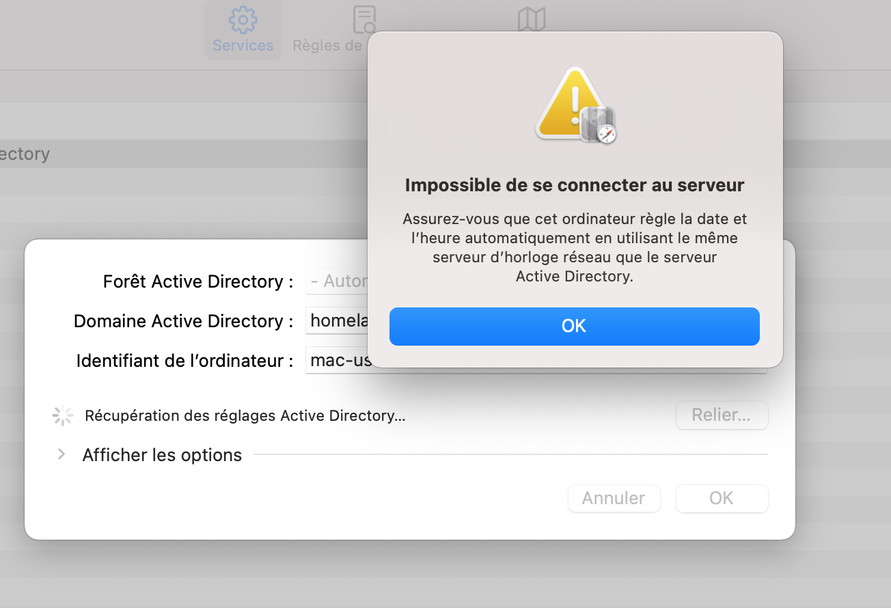  
*Après : IP fixe configurée manuellement*

### 3.2 Installation des rôles AD DS, DNS et DHCP

Les trois rôles sont installés ensemble via le **Gestionnaire de serveur** :

- **AD DS** — Active Directory Domain Services : gestion centralisée des utilisateurs et des machines
- **DNS** — résolution des noms dans le domaine `homelab.dc`
- **DHCP** — distribution automatique des adresses IP aux clients

Après promotion du serveur en **contrôleur de domaine**, le domaine `homelab.dc` est créé.


### 3.3 Configuration du DHCP

**Étendue configurée :**

| Paramètre | Valeur |
|-----------|--------|
| Plage d'adresses | XXX.XXX.1.120 → XXX.XXX.1.200 |
| Masque | /24 (255.255.255.0) |
| Passerelle (option 003) | XXX.XXX.1.1 |
| Serveur DNS (option 006) | XXX.XXX.1.110 (DC_SRV) |
| Suffixe DNS (option 015) | homelab.dc |

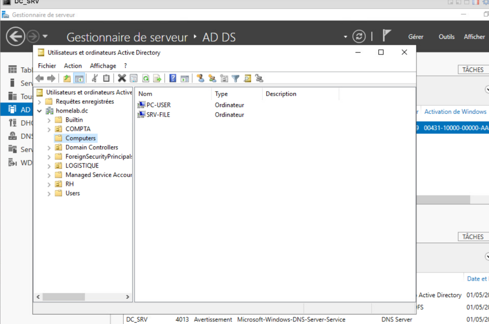

> 💡 Le suffixe DNS `homelab.dc` est distribué automatiquement aux clients : ils pourront résoudre `dc_srv.homelab.dc` sans configuration manuelle.

### 3.4 Configuration du DNS

Deux zones sont créées :

**Zone de recherche directe** — `homelab.dc`  
Résout les noms en adresses IP (`dc_srv.homelab.dc` → `XXX.XXX.1.110`)

**Zone de recherche inversée** — `1.168.192.in-addr.arpa`  
Résout les adresses IP en noms (indispensable pour la stabilité d'AD)

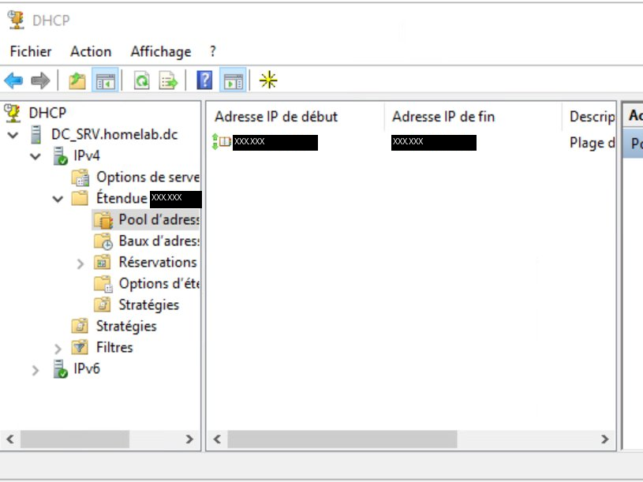

---

## 4. Déploiement PXE via WDS

> **WDS (Windows Deployment Services)** permet de déployer Windows sur un poste via le réseau, sans clé USB. Idéal pour industrialiser les installations en entreprise.

### 4.1 Principe du boot PXE

```
Poste client s'allume
       │
       ▼
[BIOS] ── demande IP via DHCP ──► [DC_SRV / DHCP]
       │                                │
       │◄─── IP attribuée + options WDS ─┘
       │
       ▼
Télécharge boot.wim depuis DC_SRV
       │
       ▼
Windows PE se charge en mémoire
       │
       ▼
Authentification domaine ► choix de l'image ► installation
```

### 4.2 Installation du rôle WDS

Le rôle WDS est ajouté via le Gestionnaire de serveur sur DC_SRV, avec les deux composants :
- **Serveur de déploiement** — gère les images
- **Serveur de transport** — gère le transfert réseau (multicast possible)

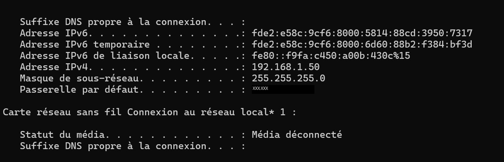

### 4.3 Transfert des sources via USB Passthrough ESXi

Pour copier les fichiers d'installation Windows 10 sur la VM sans passer par le réseau, la fonction **USB Passthrough** d'ESXi est utilisée : une clé USB physique branchée sur le NUC est redirigée directement dans la VM DC_SRV.

**Étapes dans l'interface ESXi :**
1. Modifier les paramètres de la VM DC_SRV
2. Ajouter un périphérique → **Contrôleur USB (USB 3.1)**
3. Ajouter un périphérique → **Périphérique USB** → sélectionner la clé dans la liste

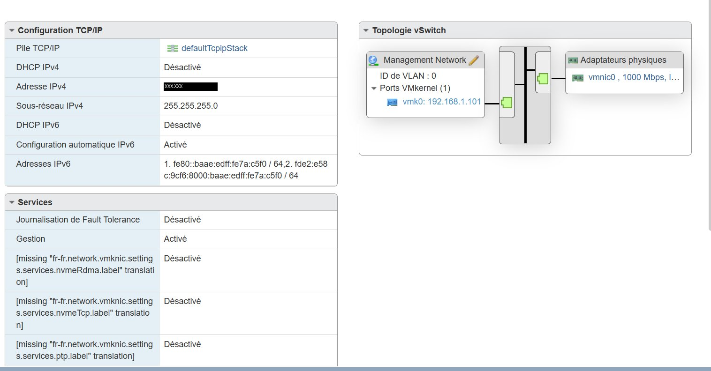

La clé apparaît instantanément dans Windows Server (lettre `E:`), sans redémarrage.

**Fichiers nécessaires** dans le dossier `\sources` de l'ISO Windows 10 :

| Fichier | Rôle |
|---------|------|
| `boot.wim` | Environnement Windows PE (amorçage réseau) |
| `install.wim` | Image complète du système à déployer |

### 4.4 Configuration initiale du serveur WDS

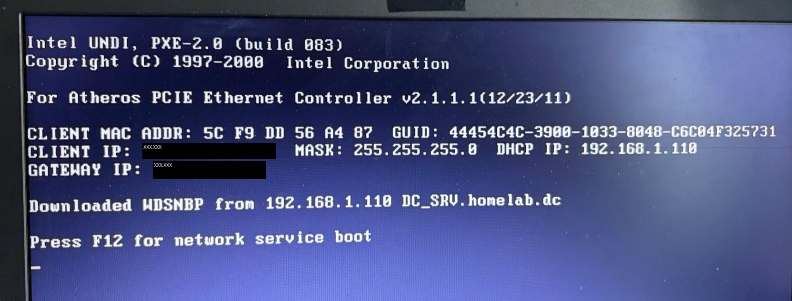

Paramètres clés :

| Option | Valeur choisie | Explication |
|--------|---------------|-------------|
| Intégration AD | Oui | Les déploiements sont tracés dans l'annuaire |
| Dossier de stockage | `C:\RemoteInstall` | Héberge les images WIM |
| Réponse PXE | Tous les clients (connus et inconnus) | Pratique en lab — à restreindre en production |
| Option DHCP 60 | Activée (PXEClient) | Informe le client que WDS est disponible |
| Ne pas écouter sur port 67 | Activé | Évite le conflit avec le service DHCP sur le même serveur |

> ⚠️ **Conflit WDS/DHCP sur le même serveur** : quand les deux rôles cohabitent, il faut cocher *"Ne pas écouter sur les ports DHCP"* dans WDS ET activer l'option DHCP 60. Sans ça, les deux services se marchent dessus sur le port 67.

### 4.5 Import des images

**Image de démarrage (boot.wim) :**  
Clic droit sur *Images de démarrage* → *Ajouter une image de démarrage* → sélectionner `boot.wim`

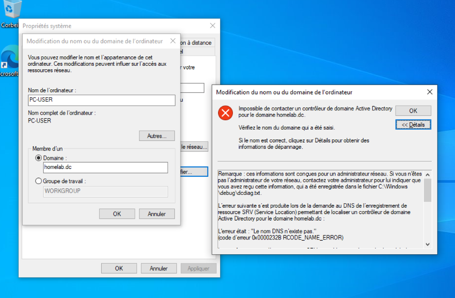

**Image d'installation (install.wim) :**  
M�me procédure. L'ISO Windows 10 étant multi-éditions, seule l'édition **Windows 10 Pro x64** est importée.

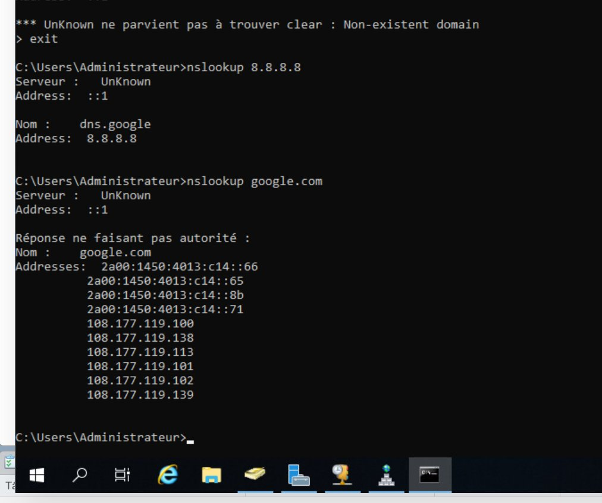

### 4.6 Préparation du Vostro pour le boot PXE

Le Dell Vostro date de 2012 — configuration particulière nécessaire :

| Paramètre BIOS | Valeur |
|---------------|--------|
| Mode de démarrage | **Legacy** (pas UEFI) |
| Secure Boot | Désactivé |
| Onboard NIC / PXE | Activé |
| Ordre de démarrage | **Network boot en 1ère position** |

### 4.7 Déroulement du déploiement

Au démarrage du Vostro :

1. Le client obtient une IP du DHCP (`XXX.XXX.1.120`)
2. Il télécharge `WDSNBP` (bootloader WDS) depuis `DC_SRV.homelab.dc`
3. Le message *"Press F12 for network service boot"* s'affiche → appui sur **F12**
4. `boot.wim` se charge → Windows PE démarre en mémoire
5. Authentification avec un compte du domaine `homelab.dc`
6. Sélection de l'image : **Windows 10 Pro x64**
7. Choix de la partition cible → déploiement automatique

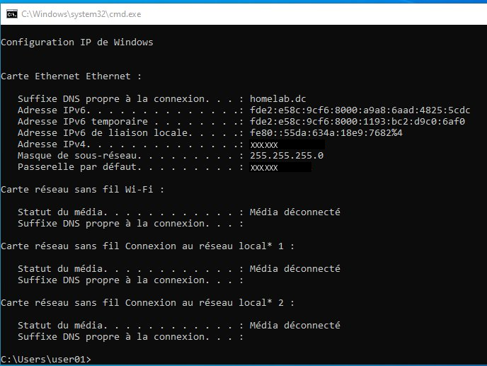

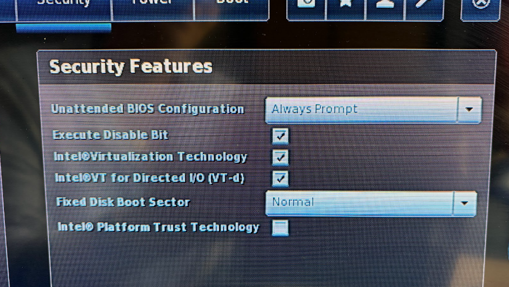

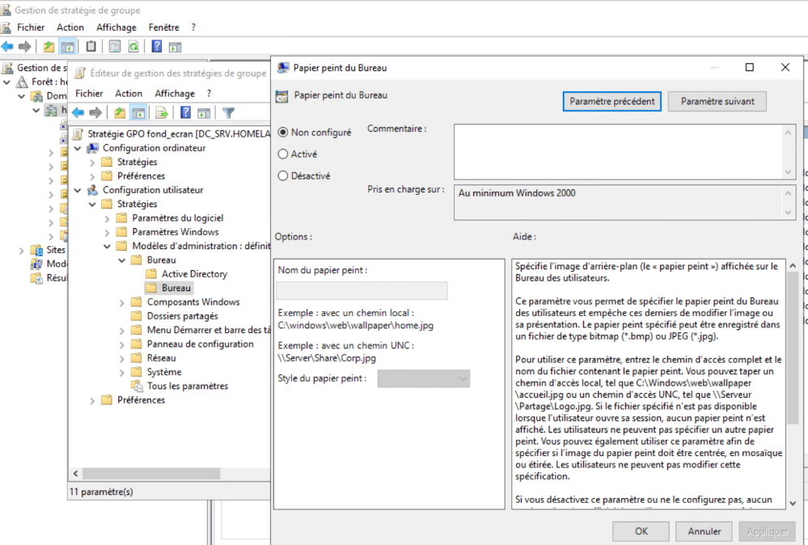

---

## 5. Jonction au domaine — Vostro PC-USER

### 5.1 Vérification réseau post-déploiement

Après installation via WDS, le Vostro (renommé **PC-USER**) reçoit :
- IP `XXX.XXX.1.120` via DHCP
- DNS pointé sur `XXX.XXX.1.110` (DC_SRV)
- Suffixe DNS `homelab.dc`

### 5.2 Problème rencontré : échec de jonction DNS

**Symptôme** : message *"Impossible de contacter un contrôleur de domaine Active Directory pour le domaine homelab.dc"*

**Diagnostic** :  
Un poste qui rejoint un domaine AD doit interroger un DNS capable de résoudre les enregistrements **SRV Kerberos** (`_ldap._tcp.dc._msdcs.homelab.dc`). Ce rôle est tenu par DC_SRV **uniquement**. Si le client interroge le DNS du routeur ou `8.8.8.8`, la résolution échoue.

**Résolution** :  
Forcer manuellement le DNS préféré sur `XXX.XXX.1.110` dans les propriétés TCP/IPv4.

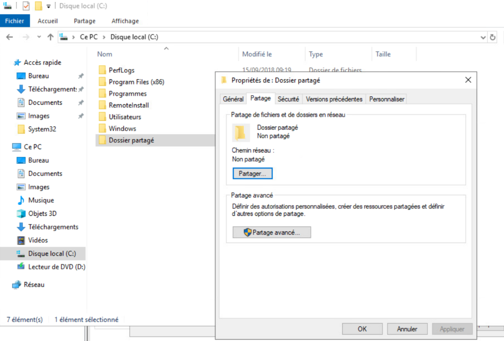

### 5.3 Jonction réussie

Procédure : *Système → Paramètres système avancés → Nom de l'ordinateur → Modifier → Domaine : `homelab.dc`*

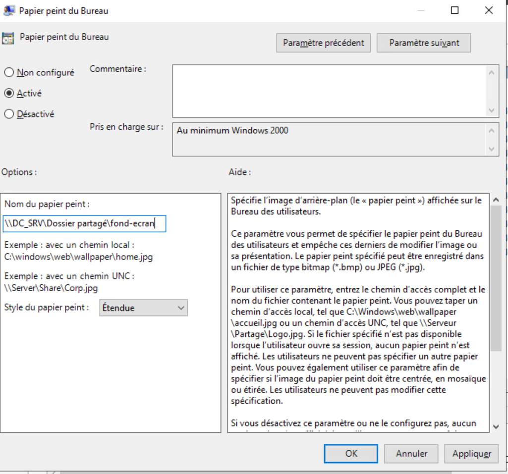

### 5.4 Validation côté Active Directory

Après redémarrage, le poste **PC-USER** est visible dans la console *Utilisateurs et ordinateurs Active Directory* sous le conteneur `Computers`.


---

## 6. Stratégies de groupe (GPO)

> Les GPO (Group Policy Objects) permettent d'appliquer des configurations à un ensemble d'utilisateurs ou d'ordinateurs du domaine, de façon centralisée et automatique.

**Trois GPO ont été déployées :**

| GPO | Cible | Effet |
|-----|-------|-------|
| `fond_ecran` | Domaine entier | Impose un fond d'écran via partage réseau |
| `panneau_de_config` | OU LOGISTIQUE | Bloque l'accès au Panneau de configuration |
| `gpo_MDP` | Domaine entier | Politique de mot de passe renforcée |

### 6.1 GPO fond_ecran

**Objectif :** imposer une image de fond d'écran à tous les utilisateurs du domaine, stockée sur un partage réseau du DC.

**Étape 1 — Création du partage réseau sur DC_SRV**

Un dossier `Dossier partagé` est créé sur `C:\` du DC et partagé avec les droits suivants :
- `Tout le monde` → **Lecture**
- `Administrateur` → Lecture/écriture

Le chemin UNC résultant : `\\DC_SRV\Dossier partagé`

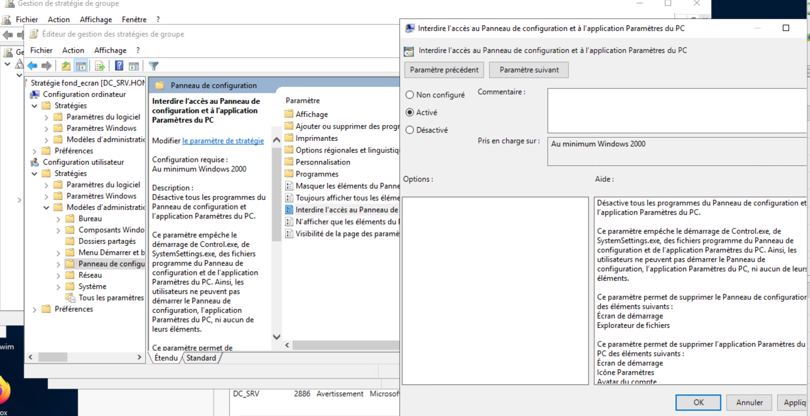

**Étape 2 — Configuration de la GPO**

Dans l'*Éditeur de gestion des stratégies de groupe* :  
`Configuration utilisateur → Stratégies → Modèles d'administration → Bureau → Bureau → Papier peint du Bureau`

Paramètres :
- **État** : Activé
- **Chemin du papier peint** : `\\DC_SRV\Dossier partagé\fond-ecran`
- **Style** : Étendu (remplit l'écran quelle que soit la résolution)

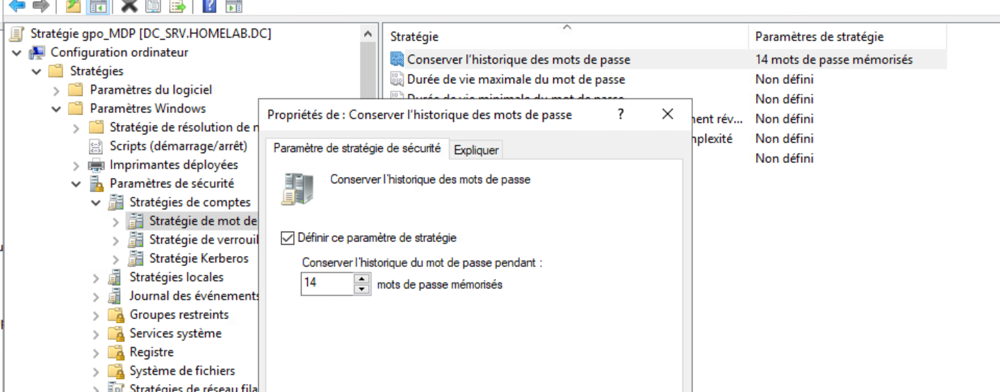

**Résultat côté client :**

Après `gpupdate /force` et ouverture de session, le fond d'écran imposé s'affiche. L'utilisateur ne peut pas le modifier.

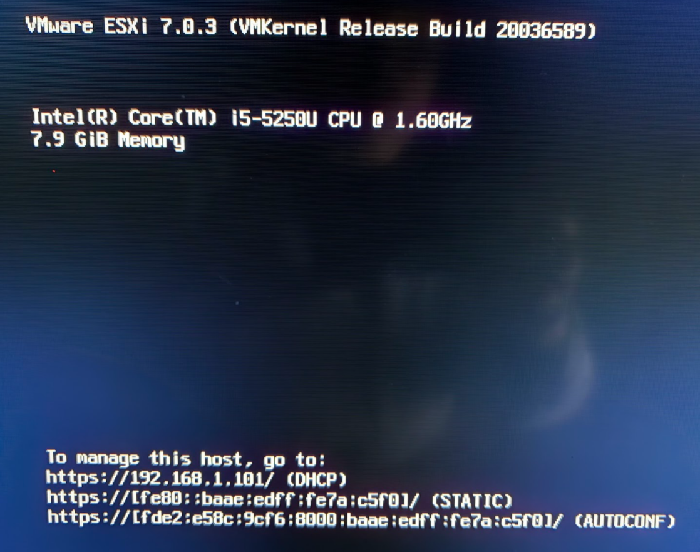

---

### 6.2 GPO panneau_de_config

**Objectif :** empêcher les utilisateurs du service LOGISTIQUE de modifier la configuration de leur poste.

**Paramètre configuré :**  
`Configuration utilisateur → Stratégies → Modèles d'administration → Panneau de configuration`  
→ *"Interdire l'accès au Panneau de configuration et à l'application Paramètres du PC"* : **Activé**

> Ce paramètre désactive à la fois `Control.exe` (version classique) et `SystemSettings.exe` (version moderne Windows 10).

La GPO est liée à l'**OU LOGISTIQUE** uniquement — les administrateurs ne sont pas affectés.

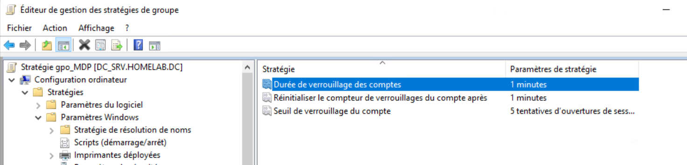

**Résultat côté client (compte LOGISTIQUE) :**

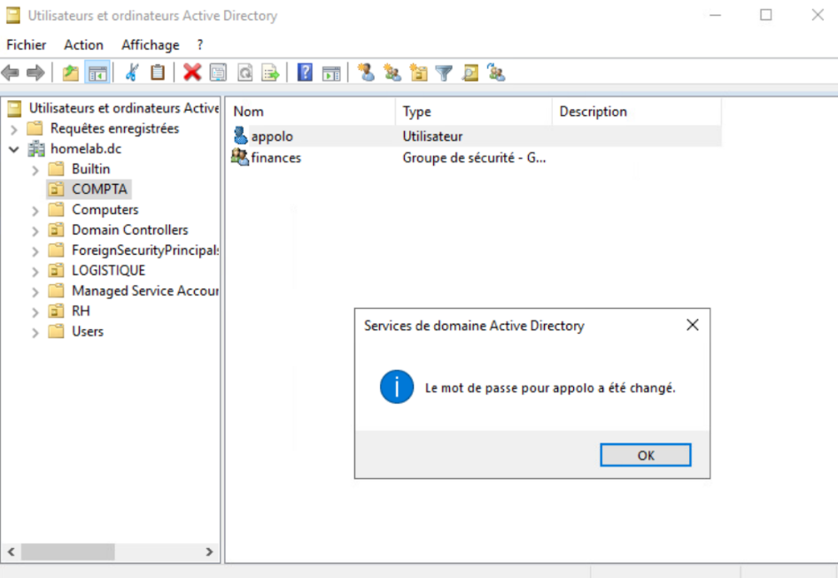

*"Cette opération a été annulée en raison de restrictions sur cet ordinateur."*

---

### 6.3 GPO gpo_MDP

**Objectif :** appliquer une politique de mot de passe robuste au niveau du domaine.

> ⚠️ Les politiques de mot de passe **doivent être configurées au niveau du domaine** (pas d'une OU) pour s'appliquer aux comptes AD. Elles se trouvent dans `Configuration ordinateur → Paramètres Windows → Paramètres de sécurité → Stratégies de comptes`.

**Paramètres configurés :**

| Paramètre | Valeur | Justification |
|-----------|--------|---------------|
| Longueur minimale | **14 caractères** | Recommandation ANSSI pour comptes nominatifs |
| Durée de vie maximale | **60 jours** | Renouvellement régulier obligatoire |
| Durée de vie minimale | **30 jours** | Empêche le contournement de l'historique |
| Historique des mots de passe | **14 mots de passe** | Évite la réutilisation des anciens MDP |
| Seuil de verrouillage | **5 tentatives** | Protection contre la force brute |
| Durée de verrouillage | **5 minutes** | Compromis sécurité / confort utilisateur |
| Fenêtre d'observation | **5 minutes** | Reset du compteur après 5 min sans échec |

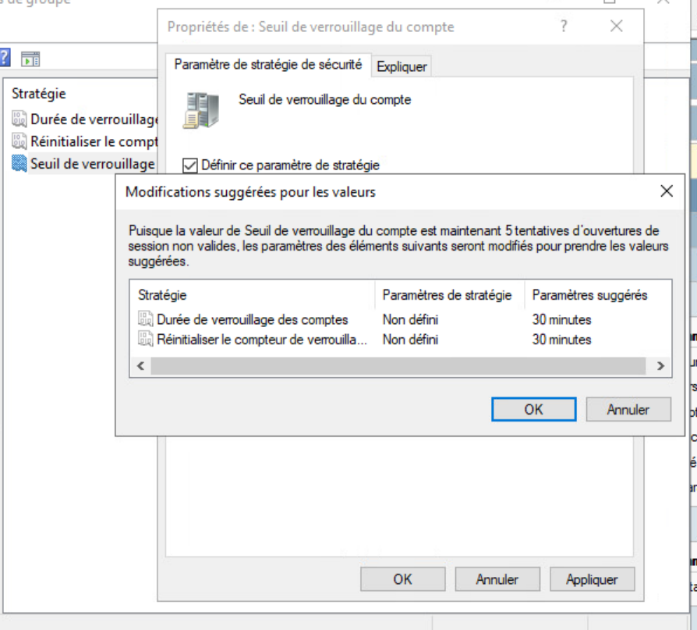

**Validation avec `net accounts` sur DC_SRV :**

```cmd
C:\> net accounts
```


La commande confirme que toutes les règles sont bien prises en compte par le contrôleur de domaine (`Rôle de l'ordinateur : PRINCIPAL`).

**Test côté client — Vostro / compte `appolo` :**

*Tentative avec un mot de passe trop court → rejet de la GPO :*

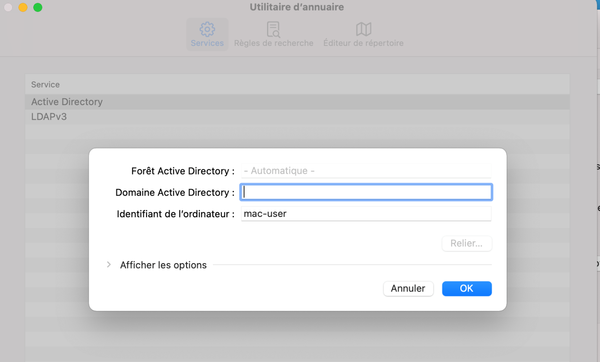

*Tentative avec un mot de passe conforme (≥ 14 caractères) → succès :*

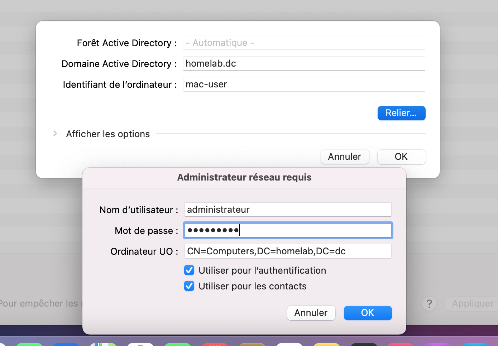

---

## 7. Serveur de fichiers — SRV_FILES

### 7.1 Création de la VM dans ESXi

| Paramètre | Valeur |
|-----------|--------|
| OS invité | Windows Server 2019 Standard (64 bits) |
| vCPU | 2 |
| RAM | 4 Go |
| Disque | 90 Go (contrôleur LSI Logic SAS) |
| Réseau | VM Network (même LAN que DC_SRV) |

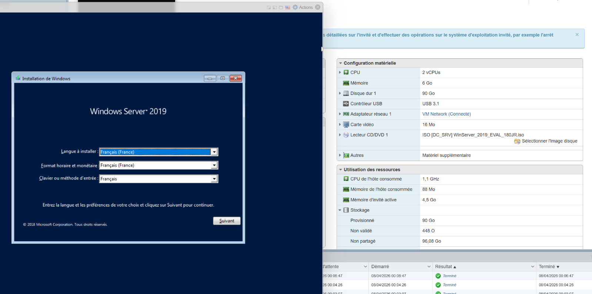

### 7.2 Problème rencontré : nom d'hôte non conforme

**Symptôme :** Windows refuse la jonction en signalant un nom non standard.

**Cause :** le nom initial `SRV_FILE` contient un **underscore `_`**, interdit par la RFC 952/1123 pour les noms DNS.

**Résolution :** renommage en `SRV-FILE` (tiret à la place de l'underscore) → redémarrage → jonction relancée.

### 7.3 Problème rencontré : DNS mal configuré

M�me problème que pour le Vostro : le DNS `8.8.8.8` était en premier dans la liste, avant `XXX.XXX.1.110`. Google DNS ne connaît pas la zone interne `homelab.dc`.

**Résolution :**
1. Retirer `8.8.8.8` du DNS préféré
2. Mettre `XXX.XXX.1.110` en DNS **unique préféré**
3. Vider le cache DNS : `ipconfig /flushdns`

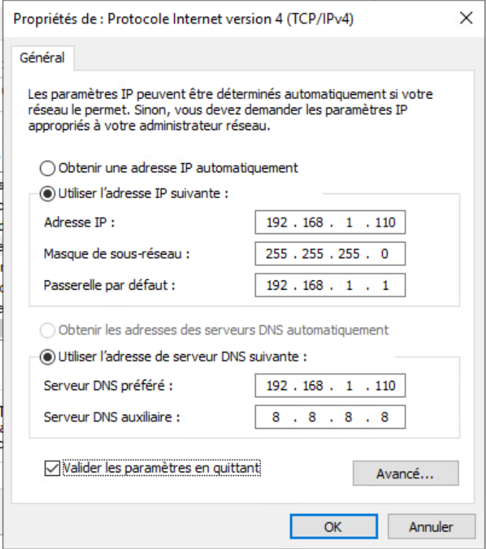

Le `nslookup homelab.dc` renvoie bien `dc_srv.homelab.dc` → jonction réussie.

### 7.4 Validation finale

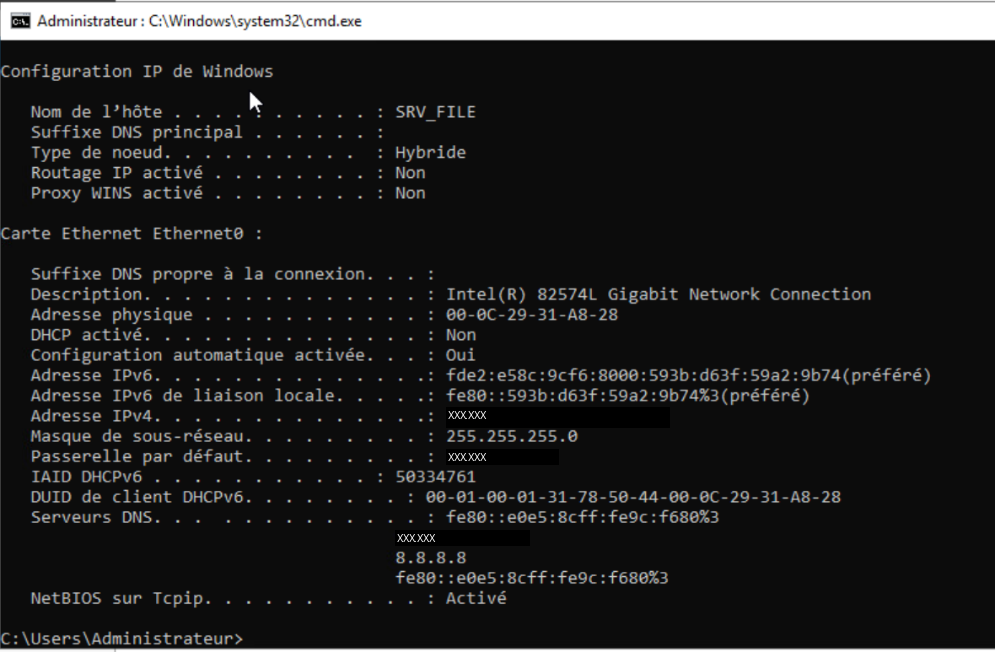

Les deux objets ordinateur **PC-USER** et **SRV-FILE** sont visibles dans la console Active Directory, sous `Computers`. Les OU métier (COMPTA, LOGISTIQUE, RH) sont également en place.

---

## 8. Supervision avec Nagios 4

### 8.1 Pourquoi Nagios ?

| Critère | Nagios 4 |
|---------|----------|
| Consommation RAM | < 100 Mo |
| CPU | Très faible |
| Licence | Open source (gratuit) |
| Maturité | Très éprouvé en entreprise |

Nagios 4 a été préféré à Zabbix ou PRTG pour sa légèreté, adaptée aux ressources limitées du NUC.

### 8.2 Installation

La VM Nagios (Debian/Ubuntu) a l'IP fixe `XXX.XXX.1.123`.

```bash
# Installation Nagios + Apache
apt-get install nagios4 apache2 -y

# Création du compte admin
htpasswd -c /etc/nagios4/htpasswd.users nagiosadmin
```

Un enregistrement DNS de type A est ajouté dans la zone `homelab.dc` :  
`nagios → XXX.XXX.1.123`

Interface accessible via : `http://nagios.homelab.dc/nagios4`

### 8.3 Agents de supervision

**Machines Linux → NRPE :**
```bash
apt-get install -y nagios-nrpe-server nagios-plugins
```

**Machines Windows → NSClient++ :**  
Téléchargeable sur [nsclient.org](https://nsclient.org). Lors de l'installation, renseigner l'IP du serveur Nagios (`XXX.XXX.1.123`) comme serveur autorisé.

> ⚠️ **NSClient++ doit toujours être actif !** C'est un service Windows qui tourne en arrière-plan. S'il est arrêté, Nagios perd la supervision de la machine. Vérifier qu'il est configuré en **démarrage automatique**.

**Machines supervisées :**

| Machine | IP | Rôle |
|---------|-----|------|
| DC_SRV | XXX.XXX.1.110 | Contrôleur de domaine |
| SRV_FILES | XXX.XXX.1.121 | Serveur de fichiers |
| PC-USER | XXX.XXX.1.120 | Poste de travail |


### 8.4 Incident : décalage horaire NTP → échec de jonction macOS

**Symptôme :** un Mac sous Big Sur ne peut pas rejoindre le domaine `homelab.dc`.

**Cause identifiée :** le protocole **Kerberos** (utilisé par Active Directory) **ne tolère pas plus de 5 minutes d'écart** entre les machines. Nagios a immédiatement remonté une alerte **CRITICAL** sur le service *NTP Time Sync* avec un décalage de **+8149 secondes (~2h15)**.

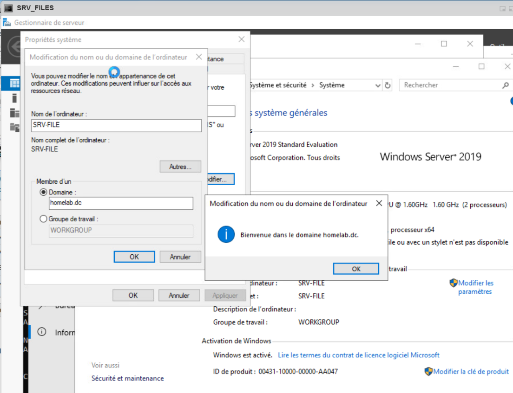

**Investigation :** la mauvaise heure ne venait pas du DC, mais de **l'hôte ESXi lui-même** qui transmettait une heure incorrecte à toutes ses VMs.

**Résolution :**
1. Configurer NTP sur l'hôte ESXi → pointer vers `pool.ntp.org`
2. Activer le démarrage automatique du service NTP sur ESXi
3. Redémarrer DC_SRV depuis ESXi

Après correction à la source, toutes les VMs ont récupéré la bonne heure → jonction macOS réussie.

---

## 9. Commutateur Cisco Catalyst 2960

### 9.1 Remise en configuration d'usine

Le Catalyst 2960 était un équipement de récupération avec une configuration inconnue. Procédure de reset complet :

**Problème initial :** le câble console n'était pas reconnu → installation des pilotes **Prolific USB-Série** nécessaire.

**Paramètres PuTTY pour la liaison console :**

| Paramètre | Valeur |
|-----------|--------|
| Vitesse | 9600 bauds |
| Bits de données | 8 |
| Parité | Aucune |
| Bits d'arrêt | 1 |
| Contrôle de flux | Aucun |

### 9.2 Procédure d'effacement (mode Boot Loader)

L'accès au mode privilégié étant restreint (mot de passe inconnu), la méthode matérielle est utilisée :

```
1. Éteindre le switch
2. Maintenir le bouton "Mode" enfoncé
3. Brancher l'alimentation tout en maintenant le bouton
4. Relâcher quand la LED SYS clignote → invite switch:
```

Commandes exécutées depuis l'invite `switch:` :

```
switch: flash_init          ← monte le système de fichiers
switch: del flash:config.text  ← supprime la config de démarrage
switch: boot                ← redémarre sur IOS vierge
```

Au redémarrage, l'**Initial Configuration Dialog** est refusé → reprise manuelle en CLI.

### 9.3 Passerelle WAN — Routeur 4G+

Le routeur Soyealink B535-333 assure la liaison WAN via 4G+. Les paramètres par défaut sont conservés pour ce lab.

---

## 10. Bilan et compétences acquises

### Ce qui a été déployé et validé

- ✅ Hyperviseur ESXi 7.0.3 sur NUC i5
- ✅ Active Directory + DNS + DHCP sur Windows Server 2019
- ✅ Déploiement OS via PXE/WDS (sans clé USB)
- ✅ Jonction de postes au domaine (Windows 10, Windows Server, macOS)
- ✅ 3 GPO fonctionnelles (fond d'écran, restriction Panneau de config, politique MDP)
- ✅ Serveur de fichiers membre du domaine
- ✅ Supervision Nagios 4 avec agents Windows et Linux
- ✅ Reset et configuration CLI d'un Cisco Catalyst 2960

### Problèmes résolus documentés

| Problème | Cause | Solution |
|----------|-------|----------|
| Jonction domaine échoue (Vostro) | DNS pointant sur routeur/8.8.8.8 | Forcer DNS sur DC_SRV |
| Jonction domaine échoue (SRV_FILES) | Underscore dans nom + mauvais DNS | Renommer en SRV-FILE + corriger DNS |
| Boot PXE Vostro (2012) | Mode UEFI incompatible | Passer en Legacy Boot |
| Conflit WDS/DHCP port 67 | Les deux rôles sur même serveur | Option DHCP 60 + "Ne pas écouter port 67" |
| macOS ne rejoint pas le domaine | Décalage horaire Kerberos > 5 min | Corriger NTP sur l'hôte ESXi |
| Clé USB non reconnue sur VM | Pas de contrôleur USB configuré | USB Passthrough ESXi |

---

*Lab construit sur matériel de récupération — Intel NUC i5, Dell Vostro, Cisco Catalyst 2960.*  
*Toutes les adresses IP sont partiellement masquées (2 premiers octets).*
